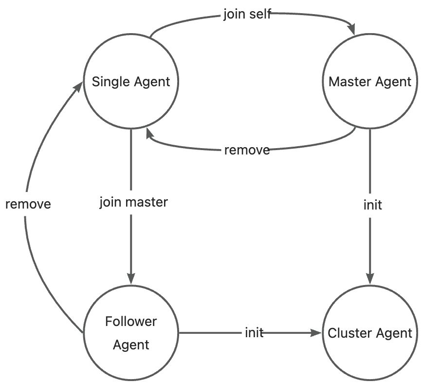
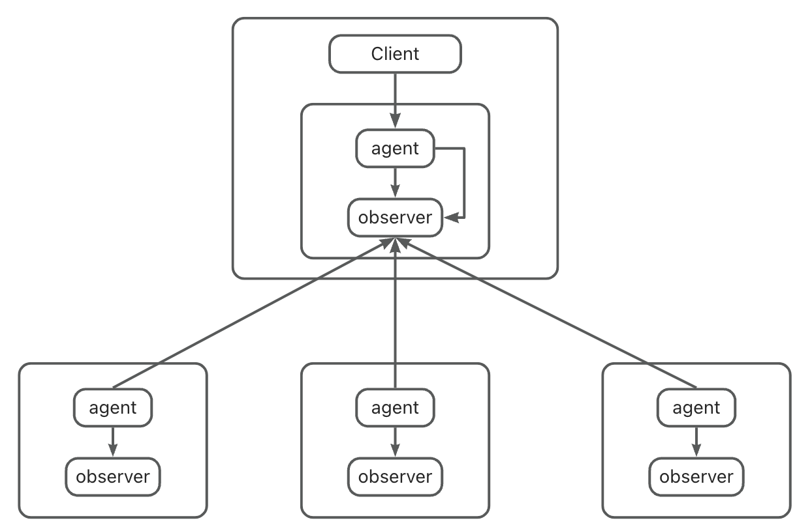

<p align="center">
  <a href="https://github.com/oceanbase/oceanbase/blob/master/LICENSE">
    
  </a>
  <a href="https://en.oceanbase.com/docs/oceanbase-database">
    
  </a>
  <a href="https://www.oceanbase.com/docs/oceanbase-database-cn">
    
  </a>
</p>

English | [Chinese](./README_CN.md)

**OBShell** (OceanBase Shell) is the no-installation cluster command-line tool provided by the [OceanBase Community](https://open.oceanbase.com/) for system administrators and developers. OBShell supports cluster operations and maintenance tasks, and offers operational management APIs based on OBServer. This allows unified management of a single cluster by different ecosystem products, thereby facilitating the integration of third-party tools with OceanBase and reducing the complexity and cost associated with OceanBase cluster management.

# Key Features
- **No Installation Required**

  OBShell does not require additional installation. Once you have installed the OceanBase-CE database through any method, you will be able to locate the OBShell executable file within the `bin` directory of the working directory on any node.

- **Operational Capabilities**
 
  OBShell, as a ready-to-use local cluster command-line tool, supports OceanBase cluster operations and maintenance including cluster deployment, cluster start, cluster stop, cluster status inquiry, cluster node scaling, and cluster upgrades, among other functionalities. Additional features are currently under development.

- **Open API**
  
  OBShell provides operational management APIs based on the OBServer, facilitating unified management of a single cluster by various ecosystem products. This streamlines the integration of third-party tools with OceanBase, effectively reducing the complexity and cost associated with managing OceanBase clusters.

- **Emergency Operation**
  
  OBShell supports emergency operations and maintenance for clusters. Even in the event of a complete OceanBase cluster outage, it can be quickly restarted with a single click and automatically take over control of the cluster, if necessary.

For more information, please refer to [OBShell](https://www.oceanbase.com/quicksearch?q=obshell).

# Quick Deployment of an OceanBase Cluster

The state machine for identity transformation in OBShell Agent is illustrated as follows:


Execute the following commands for a quick deployment of a 3-replica OceanBase database instance. See the deployment guide [here](https://www.oceanbase.com/docs/common-oceanbase-database-cn-1000000000671670).

## 🔥 Using the OBShell Command Line

1. Start the OBShell on each node by following these [instructions](https://www.oceanbase.com/docs/common-oceanbase-database-cn-1000000000671669).

    ```shell
    # Execute on xxx.xxx.xxx.1
    /home/admin/oceanbase/bin/obshell agent start --ip xxx.xxx.xxx.1
    # Execute on xxx.xxx.xxx.2
    /home/admin/oceanbase/bin/obshell agent start --ip xxx.xxx.xxx.2
    # Execute on xxx.xxx.xxx.3
    /home/admin/oceanbase/bin/obshell agent start --ip xxx.xxx.xxx.3
    ```

2. The Single Agent becomes a Master Agent and sets server-level configurations.

    ```shell
    # The Master Agent leads the cluster in executing initialization tasks.
    /home/admin/oceanbase/bin/obshell cluster join -s "xxx.xxx.xxx.1:2886" -z zone1 -p 2881 -P 2882 -o 'memory_limit=16G,system_memory=8G,log_disk_size=24G,datafile_size=24G'
    ```

3. Other Single Agents become Follower Agents and join the Master Agent.

    ```shell
    # The Follower Agent joins the Master Agent and follows the Master Agent in completing initialization tasks.
    # Execute on xxx.xxx.xxx.2
    /home/admin/oceanbase/bin/obshell cluster join -s "xxx.xxx.xxx.1:2886" -z zone2 -p 2881 -P 2882 -o 'memory_limit=16G,system_memory=8G,log_disk_size=24G,datafile_size=24G'
    # Execute on xxx.xxx.xxx.3
    /home/admin/oceanbase/bin/obshell cluster join -s "xxx.xxx.xxx.1:2886" -z zone3 -p 2881 -P 2882 -o 'memory_limit=16G,system_memory=8G,log_disk_size=24G,datafile_size=24G'
    ```

4. Set cluster-level configurations and initialize the cluster

    ```shell
    # Execute on any node
    /home/admin/oceanbase/bin/obshell cluster init -n ob-test --rp ***
    ```

5. Connect to the OceanBase cluster

    ```shell
    obclient -hxxx.xxx.xxx.1 -uroot@sys -P2881 -A -p *** 
    ```
For more information refer to the [OBShell Cluster Command Group](https://www.oceanbase.com/docs/common-oceanbase-database-cn-1000000000671675).

## 👨‍💻 Source Code Compilation

Refer to the [OBShell Compilation Guide](COMPILE.md) to learn how to compile OBShell.

# System Architecture



Each OBShell Agent manages a single observer. Operational maintenance actions for the entire cluster are initiated by one OBShell Agent, with multiple OBShell Agents working in coordination to facilitate progress.

# License

OBShell is licensed under the Apache License, Version 2.0. For details, see the [LICENSE](LICENSE) file.

# Community

Here are the ways to join the community:

* [Chinese Forum](https://ask.oceanbase.com/)
* [Slack Workspace](https://join.slack.com/t/oceanbase/shared_invite/zt-1e25oz3ol-lJ6YNqPHaKwY_mhhioyEuw)
* [Ask on Stack Overflow](https://stackoverflow.com/questions/tagged/oceanbase)
* DingTalk Group: 33254054 ([QR Code](img/dingtalk.png))
* WeChat Group (Add WeChat Assistant: OBCE666)
